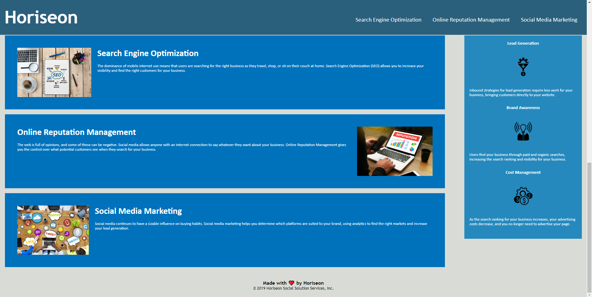

# Module_1_Challenge

## Description

When creating this project, I set out to provide the marketing agency, 'Horiseon', with a website that meets accessibility standards, as well as having semantic and logical code. By completing this assignment, I learned how the naming of elements can greatly influence one's understanding of a webpage.

## Installation

N/A

## Usage

To use this page, simply access the website, and click on one of the internal navigation links to learn more information on Search Engine Optimization.

You can access the website here: https://jeslocascio.github.io/Module_1_Challenge/

The webpage should look like this:

## Credits

Rutgers Fullstack Flex Coding Bootcamp provided the starter code.

## License

MIT License

Please refer to the LICENSE in the repo for more information.

## Features

Internal Navigation Links